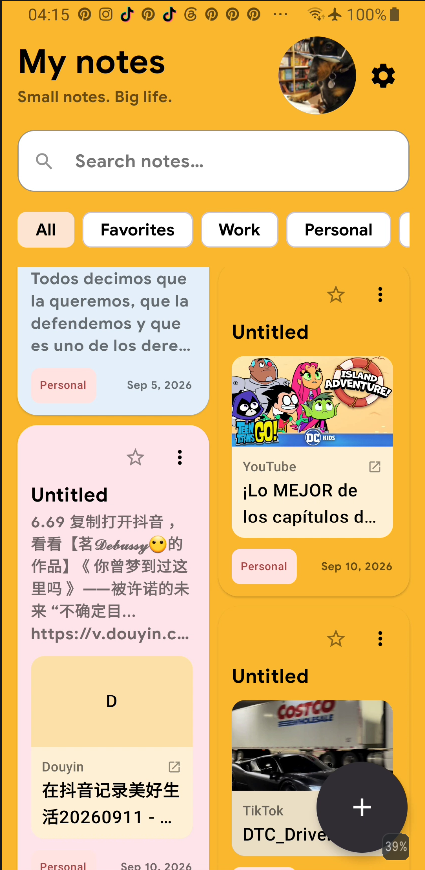
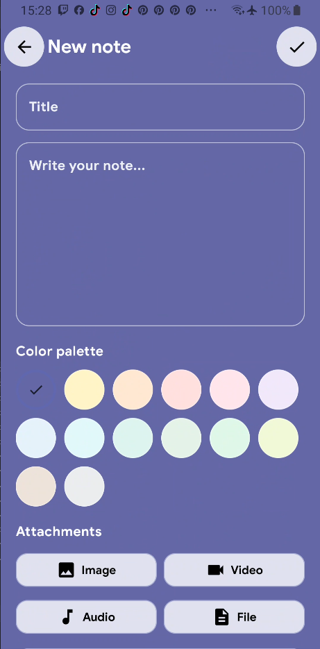
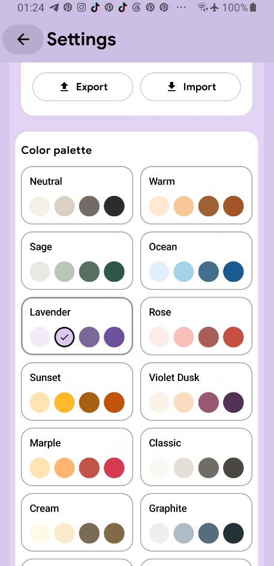
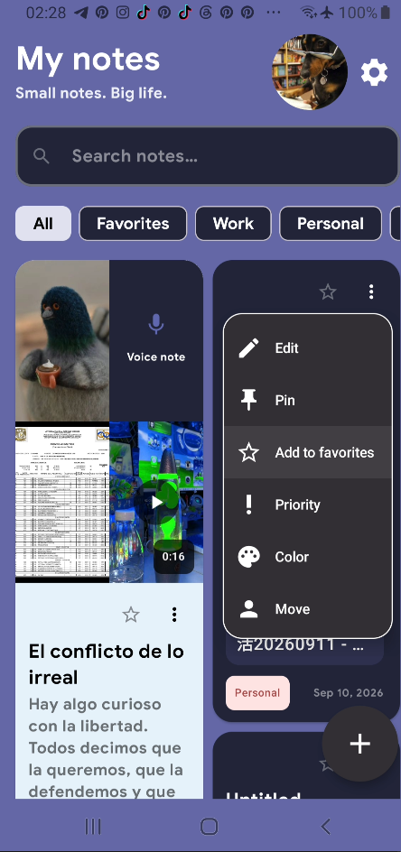

# MyNotes

MyNotes is an Android notes application built primarily with **Kotlin + Jetpack Compose**. It focuses on flexible note organization, multimedia attachments, rich link previews, extensive visual customization, adaptive performance profiles, audio feedback, backup/restore, and compatibility starting from Android 7.0.

## Project screenshots

The screenshots below are stored inside [`DOCUMENTACION_CODIGO_OBSESIVA/images/`](DOCUMENTACION_CODIGO_OBSESIVA/images/) so the repository documentation remains self-contained.

<table>
  <tr>
    <td align="center"><strong>Home screen</strong></td>
    <td align="center"><strong>Note editor</strong></td>
  </tr>
  <tr>
    <td align="center"></td>
    <td align="center"></td>
  </tr>
  <tr>
    <td align="center"><strong>Color palette settings</strong></td>
    <td align="center"><strong>Note options menu</strong></td>
  </tr>
  <tr>
    <td align="center"></td>
    <td align="center"></td>
  </tr>
</table>

## Repository

- GitHub: `https://github.com/lxxsnowxxl/Mynotes`
- Main account: `@lxxsnowxxl`
- Main branch: `main`

## Authorship and credits

- **Primary development:** Snow
- **Technical development assistance:** OpenAI ChatGPT

OpenAI ChatGPT has been used for code review, documentation, performance analysis, debugging support, and development assistance. The project's direction and primary authorship remain with Snow.

## Technical status

- Application: `MyNotes`
- Package / application ID: `com.example.mynotes`
- Version: `1.0`
- Version code: `1`
- `minSdk`: **24** — Android 7.0+
- `targetSdk`: **36**
- `compileSdk`: **37**
- Java compatibility: **11**
- UI: **Jetpack Compose + Material 3**
- Build system: **Gradle Kotlin DSL + KSP**
- Release configuration: code minification and resource shrinking enabled

## Main technologies

- Kotlin
- Jetpack Compose
- Material 3
- Room `2.7.2`
- KSP
- DataStore Preferences `1.1.7`
- Coil `3.3.0`
- Media3 / ExoPlayer `1.11.0`
- Lifecycle Runtime Compose `2.11.0`
- AppCompat `1.7.1`
- Kotlin Coroutines
- AndroidX

## Main features

- Create, edit, delete, pin, prioritize, and favorite notes.
- Organize notes by categories and filters.
- Search notes from the main screen.
- One-, two-, and three-column layouts.
- Per-note colors and global color palettes.
- Configurable fonts, light/dark appearance, panel intensity, icons, menus, buttons, and visual effects.
- Image, video, audio, voice-recording, document, PDF, text, and generic file attachments.
- Link previews for supported web content and social platforms.
- Configurable UI sounds and vibration patterns.
- Backup and restore support.
- XML preview layouts under `app/src/main/res/layout/` for studying the Compose UI from Android Studio Design / Split view.
- A development-information section inside the application with architecture, technology, authorship, source-code, repository, copyright, and performance information.

## Architecture

The project follows a responsibility-oriented architecture:

```text
Compose UI
   ↓
ViewModel
   ↓
Repository
   ↓
Room / DataStore / private files / cache
```

`MainActivity` coordinates Compose navigation and system/UI policies. ViewModels expose state and user actions. Repositories centralize persistence and data-related behavior. Room stores notes and attachment metadata, while DataStore stores user-configurable preferences.

## Data and storage

- Notes are stored locally with Room.
- Attachments are copied into the application's private storage.
- `AttachmentPreviewCache` generates and reuses attachment thumbnails through RAM and disk caching.
- Cached thumbnails are disposable and can be regenerated if Android clears the cache.
- Link-preview data is handled separately so network or metadata processing does not block the main UI.
- Maximum-quality mode includes progressive and prewarmed thumbnail strategies to reduce visible image pop-in during fast scrolling.

## Performance profiles

### Maximum performance

- Preferred display refresh rate: **60 Hz**.
- Image/video previews: up to **360 px**.
- Audio artwork: **256 px**.
- PDF previews: **480 px**.
- Prioritizes lower CPU, memory, I/O, and decoding workload.

### Balanced

- Preferred display refresh rate: **60 Hz**.
- Image/video previews: up to **720 px**.
- Audio artwork: **512 px**.
- PDF previews: **960 px**.

### Maximum quality

- Requests up to **120 Hz** when supported by the device/display stack.
- Image previews: up to **1280 px**.
- Video previews: up to **1080 px**.
- Audio artwork: **768 px**.
- PDF previews: **1440 px**.
- Uses prewarming, progressive caching, and scroll-aware loading to reduce visible thumbnail pop-in.

Refresh rates are requests to Android. The platform can select a different mode if the panel, compositor, or current system conditions do not provide the requested refresh rate.

## Android integration

Relevant permissions and platform integrations include:

- `INTERNET` for remote link-preview resources.
- `RECORD_AUDIO` for voice-note recording.
- `VIBRATE` for configurable haptic feedback.
- `MODIFY_AUDIO_SETTINGS` for temporarily suppressing system keyboard-click audio while preserving MyNotes UI sounds when that feature is active.
- The microphone is declared as optional hardware.
- `FileProvider` is used for secure file sharing.
- `ACTION_SEND` allows shared text from other applications to be turned into a note.
- Edge-to-edge / immersive UI handling.
- Compose rendering is synchronized through Android's normal Choreographer / VSYNC pipeline.

## Important source files

```text
app/src/main/java/com/example/mynotes/MainActivity.kt
app/src/main/java/com/example/mynotes/viewmodel/NoteViewModel.kt
app/src/main/java/com/example/mynotes/viewmodel/SettingsViewModel.kt
app/src/main/java/com/example/mynotes/ui/theme/NotesScreen.kt
app/src/main/java/com/example/mynotes/ui/theme/NoteEditorScreen.kt
app/src/main/java/com/example/mynotes/ui/theme/NoteDetailScreen.kt
app/src/main/java/com/example/mynotes/ui/theme/SettingsScreen.kt
app/src/main/java/com/example/mynotes/ui/theme/DevelopmentInfoScreen.kt
app/src/main/java/com/example/mynotes/ui/theme/SourceCodeInfoScreen.kt
app/src/main/java/com/example/mynotes/ui/components/NoteCard.kt
app/src/main/java/com/example/mynotes/performance/AttachmentPreviewCache.kt
app/src/main/java/com/example/mynotes/performance/DisplayPerformanceController.kt
app/src/main/java/com/example/mynotes/links/LinkPreviewRepository.kt
app/src/main/java/com/example/mynotes/settings/SettingsRepository.kt
```

## Documentation

The repository contains two levels of source documentation:

- [`DOCUMENTACION_CODIGO/`](DOCUMENTACION_CODIGO/) — compact source-code documentation.
- [`DOCUMENTACION_CODIGO_OBSESIVA/`](DOCUMENTACION_CODIGO_OBSESIVA/) — extremely detailed documentation covering variables, parameters, restrictions, scopes, callbacks, side effects, lifecycle behavior, state, caching, concurrency, Android APIs, and internal relationships.

Additional references include:

- [`DEVELOPMENT.md`](DEVELOPMENT.md)
- [`LAYOUT_PREVIEWS_ANDROID_STUDIO.md`](LAYOUT_PREVIEWS_ANDROID_STUDIO.md)
- `CAMBIOS_*.md` / `CAMBIOS_*.txt` implementation notes
- XML preview layouts under `app/src/main/res/layout/`

## Building the project

1. Clone the repository:

```bash
git clone https://github.com/lxxsnowxxl/Mynotes.git
```

2. Open the project in Android Studio.
3. Configure the Android SDK locally. `local.properties` must remain local and should not be committed.
4. Sync Gradle.
5. Build and run the app from Android Studio, or use the project's Gradle wrapper.

## Repository hygiene

The root `.gitignore` excludes common local/generated Android files such as:

```text
.gradle/
.idea/
local.properties
build/
app/build/
*.apk
*.aab
*.jks
*.keystore
keystore.properties
secrets.properties
```

Review staged files before each public push, especially when local credentials, signing files, exports, or test data have been added to the workspace.

## Copyright and license

© 2026 Snow · MyNotes

This repository currently does **not** include a `LICENSE` file, so no specific open-source license is granted by the repository itself. Android, Kotlin, Jetpack Compose, Material, Coil, Media3, and all other third-party libraries, trademarks, and assets remain subject to their respective owners and licenses.
